# Getting started

1. [ Шаг первый - настройка Keycloak. ](#step1)
    - [Установка](#step1install)
    - [Изменить порт на 8888](#port)
2. [Шаг второй - настройка Auth Gateway](#step2)
    - [Установка](#step2install)
3. [Шаг третий - подключение клиента к Auth Gateway](#step3)
    - [Схема SSO аутентификации](#schema)
    - [Требования к приложению](#specs)
    - [Установка](#step3install)

<a name="step1"></a>
# Шаг первый - настройка Keycloak

Keycloak это открытый сервер SSO аутентификации, разворачиваемый на базе Wildfly.

<a name="step1install"></a>
## Установка

1. Скачайте Keycloak в варианте [Standalone server](https://www.keycloak.org/downloads)

2. Запустите команду `/bin/standalone` (сервер поднимется по порту 8080, рекомендуется [изменить этот порт на 8888](#port))

3. Перейдите по адресу http://localhost:8888/auth

4. Создайте нового администратора для консоли Keycloak.

   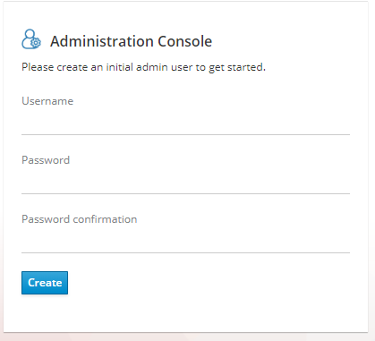

5. Перейдите по ссылке "Administration Console" и войдите в консоль администрирования.

6. Создайте домен системы (Add realm).

   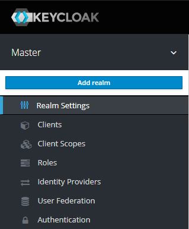

7. Создайте клиент OAuth2 (Clients > Create). Клиент - это приложение, которое будет аутентифицироваться в Keycloak. В поле "Client ID" задаётся идентификатор клиента. 

   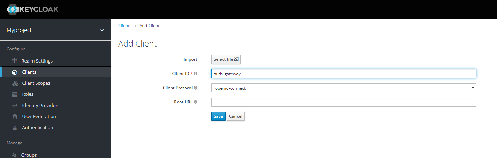

8. Нажмите "Save", откроется форма редактирования клиента. В поле "Access Type" выберите "confidential", чтобы никто не смог войти в Keycloak с помощью вашего клиента. Убедитесь, что поле "Standard Flow Enabled" находится в положении "ON". Этот режим позволяет входить в ваше приложение через браузер. В поле "Valid Redirect URIs" укажите правильные префиксы адресов, на которые возможна переадресация после успешного входа. Снова нажмите "Save".

   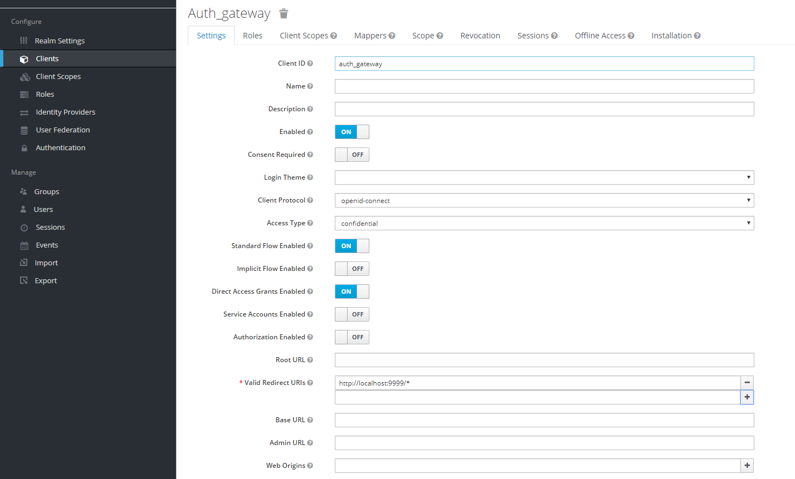

9. На вкладке "Credentials" будет информация о секретном слове (поле "Secret"). Скопируйте его и используйте <a href="#secretField"> в настройках OAuth2 аутентификации вашего приложения </a>.

   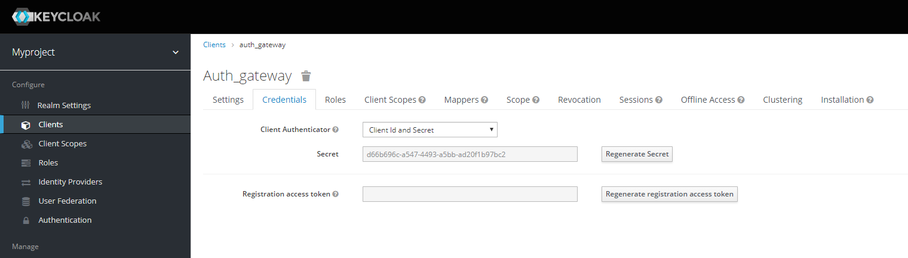

10. Задайте маппинг ролей (Clients > Ваш клиент > Mappers). Кликните по кнопке "Add Builtin" выберите "realm roles" и нажмите "Add selected". Нажмите кнопку Edit у появившегося маппера. В поле "Token Claim Name" измените значение на "roles". Установите переключатель "Add to userinfo" в положение "ON". Нажмите "Save".

    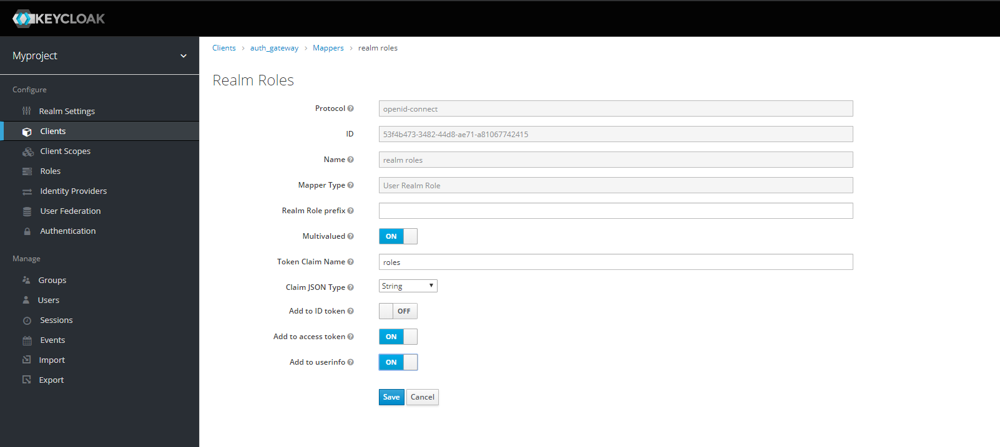

11. Создайте роль "admin" для администрирования системы (Roles > Add role).

    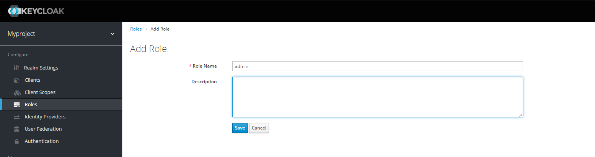

12. Создайте пользователя "admin", под которым Вы будете входить в модуль администрирования доступа (Users > Add user). Задайте "Email" и установите переключатель "Email Verified" в положение "ON". Нажмите "Save".

    

13. На вкладке "Role Mappings" добавьте роль "admin".

    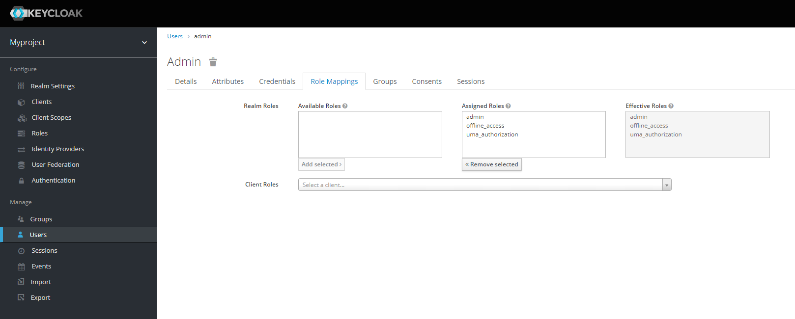

14. На вкладке "Credentials" дважды введите пароль пользователя. И переключите поле "Temporary" в положение "OFF". Нажмите "Set Password".

    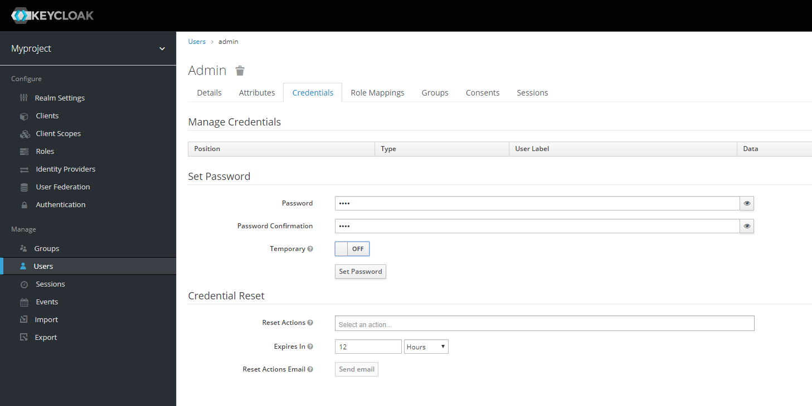

15. Для корректной отправки сообщений пользователю (с напоминанием пароля, подтверждением учетных данных и тд.) из Keycloak пропишите найстройки вашего Email сервера (Realm settings > Email).

    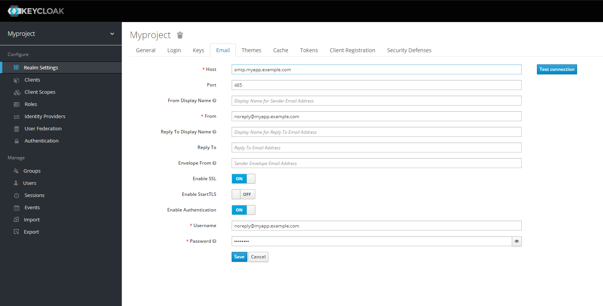

<a name="port"></a>
## Изменить порт на 8888

1. Перейдите в `/standalone/configuration/` и откройте файл standalone.xml

2. Измените строку и сохраните файл.

   ```
   <socket-binding name="http" port="${jboss.http.port:8888}"/>
   ```

<a name="step2"></a>
# Шаг второй - настройка Auth Gateway

Auth Gateway - это SSO сервер, построенный на базе Spring Cloud Security, интегрируемый с любыми другими серверами аутентификации по протоколу OAuth2 OpenId Connect, например, с Keycloak или ЕСИА.

<a name="step2install"></a>
## Установка

1. Соберите Auth Gateway выполнив команду `mvn clean package`.

2. <a name="secretField"></a>Для подключения Auth Gateway к Keycloak серверу необходимо задать следующие настройки в application.properties, который находится в директории `auth-gateway/src/main/resources`:

   ```
   #Базовый адрес сервера Keycloak 
   access.keycloak.server-url=http://localhost:8888/auth
   #Название домена (реалма), в случае примера myproject
   access.keycloak.realm=myproject 
   #Идентификатор клиента Auth Gateway в Keycloak, в случае примера auth_gateway
   access.keycloak.client.client-id=auth_gateway 
   #Секретное слово клиента Auth Gateway в Keycloak, в случае примера d66b696c-a547-4493-a5bb-ad20f1b97bc2
   access.keycloak.client.client-secret=d66b696c-a547-4493-a5bb-ad20f1b97bc2
   ```

3. Создайте базу данных под названием `security`. Настройки по умолчанию для базы данных сервера auth-gateway:

   ```
   spring.datasource.url=jdbc:postgresql://localhost:5432/security
   spring.datasource.username=postgres
   spring.datasource.password=postgres
   ```

4. Запустите сервер командой `java -jar auth-gateway.jar`

5. Согласно протоколу OAuth2 шлюзовой сервер аутентификации открывает следующие эндпоинты, проверьте их доступность:

   ```
   Authorization endpoint: /oauth/authorize
   Token endpoint: /oauth/token
   UserInfo endpoint: /userinfo
   Admin API: /api/info
   ```
<a name="step3"></a>
# Шаг третий - подключение клиента к Auth Gateway

<a name="schema"></a>
## Схема SSO аутентификации

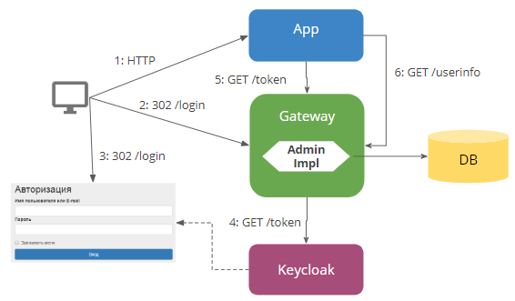

1. Запросы неавторизованных пользователей перенаправляют на Auth Gateway сервер.
2. Auth Gateway сервер пренаправляет пользователя на Keycloak.
3. Keycloak показывает пользователю страницу входа.
4. Auth Gateway сервер получает Keycloak токен пользователя GET запросом `/token` к Keycloak.
5. Приложение получает Auth Gateway токен пользователя GET запросом `/token` к Auth Gateway.
6. Приложение получает информацию о пользователе выполняя авторизованный GET запрос `/userinfo` к Auth Gateway.

<a name="specs"></a>
## Требования к приложению

1. Spring Boot 2.1
2. N2O Framework 7.3

<a name="step3install"></a>
## Установка

1. Выполните [настройку Auth Gateway](#step2).

2. Добавьте зависимость `security-auth-oauth2`. Она содержит класс `OpenIdSecurityConfigurerAdapter` и транзитивные зависимости от `spring-security-oauth2`:

   ```
   <dependency>
       <groupId>net.n2oapp.framework.security</groupId>
       <artifactId>security-auth-oauth2</artifactId>
       <version>${security-admin.version}</version>
   </dependency>
   ```

3. Создайте класс конфигурации правил доступа:

   ```
   @Configuration
   @EnableWebSecurity
   public class SecurityConfig extends OpenIdSecurityConfigurerAdapter {
   
       @Override
       protected void authorize(ExpressionUrlAuthorizationConfigurer<HttpSecurity>
                                   .ExpressionInterceptUrlRegistry url) throwsException {
           url.anyRequest().authenticated();//все запросы авторизованы
       }
   }
   ```

4. Добавьте зависимость `security-auth-oauth2-gateway`. В ней находится реализация интерфейса `PrincipalExtractor` с помощью которой будут получены атрибуты пользователя из Auth Gateway:

   ```
   <dependency>
       <groupId>net.n2oapp.framework.security</groupId>
       <artifactId>security-auth-oauth2-gateway</artifactId>
       <version>${security-admin.version}</version>
   </dependency>
   ```

5. Для соединения с Auth Gateway сервером задайте следующие настройки в файле `application.properties` клиента:

   ```
   #Базовый адрес сервиса аутентификации Auth Gateway
   security.oauth2.auth-server-uri=http://localhost:9999
   #Идентификатор клиента OAuth2 OpenId Connect (придумывается вами)
   security.oauth2.client.client-id=myapp
   #Секретное слово клиента OAuth2 OpenId Connect (генерируется вами)
   security.oauth2.client.client-secret=711991d0-bb60-4d33-9d90-fffc44571e2e
   #Запрашиваемый уровень доступа
   security.oauth2.client.scope=read,write
   #Адрес сервиса аутентификации через браузер
   security.oauth2.client.user-authorization-uri=${security.oauth2.auth-server-uri}/oauth/authorize
   #Адрес сервиса получения токена аутентификации
   security.oauth2.client.access-token-uri=${security.oauth2.auth-server-uri}/oauth/token
   #Адрес сервиса получения информации о пользователе
   security.oauth2.resource.user-info-uri=${security.oauth2.auth-server-uri}/userinfo
   #Адрес сервиса единого выхода
   security.oauth2.sso.logout-uri=${security.oauth2.auth-server-uri}/logout?redirect_uri=
   ```

6. Зарегистрируйте клиента OAuth2, который будет аутентифицироваться в Auth Gateway. Для этого вам нужно добавить информацию о клиенте в таблицу "client", которая находится в базе данных security, схема sec. Необходимо указать:

   ```
   # client_id - id клиента, который будет обращаться к серверу auth-gateway, в случае этого примера - myapp.
   # client_secret - секретное слово клиента, который будет обращаться к серверу auth-gateway, в случае этого примера - 711991d0-bb60-4d33-9d90-fffc44571e2e. 
   # grant_types - типы авторизации (допустим client_credentials,authorization_code)
   # redirect_uris - URI разрешенные для редиректа после авторизации
   # access_token_lifetime - время жизни токена
   # refresh_token_lifetime - время жизни refresh токена
   # logout_url - URL для выхода
   ```   